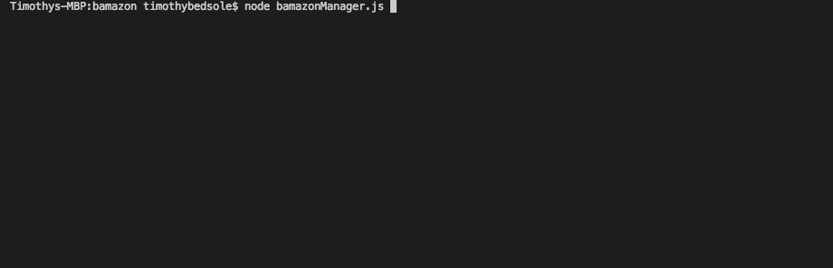

# Bamazon

This repo holds my solution for the SQL homework assignment.

Bamazon is an application this functions within the terminal. It communicates with a database to get information to the end user. There are three different JavaScript files associated with this assignment, all of which have different database functionality available to them.

## Bamazon Customer

The bamazonCustomer.js file holds the logic for the Customer end user. When the file is run in the terminal, the customer sees a list of items available for purchase and may enter the item they wish to purchase.

If the quantity the customer requests exceeds the available stock quantity, the program alerts the user.

## Bamazon Manager

The bamazonManager.js file holds the logic for the Manager end user. When the file is run in the terminal, the user is prompted with a list of actions to choose from.

The first option is to view all items that are currently for sale. All of the items are presented in a table format.

The next option is to view low inventory. This displays all items that have a stock quantity that is less than 15 in a table format.

The next option is to change the stock of an item in the database. When the user chooses this option, they are asked to select an item and then put it the desired amount for that item.

The last option for the manager is to add a new item into the database. When the user chooses this option, they are asked for the item name, the department it belongs in, the price, and the quantity of the item.

